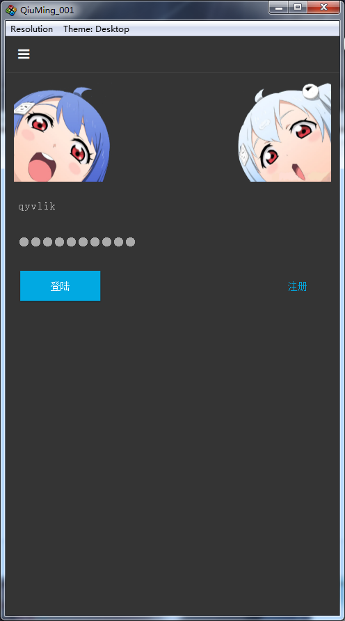

# QiuMing

Old driver drag racing.

> author: @hxiaope, @qyvlik,@JM

使用了 `WebScoket` 协议和 `V-Play` 框架进行构建的项目。

如果你需要参考如何构建一个简单以 `WebScoket` 为基础通讯，并且以 `v-play` 作为客户端构建框架的项目。可以参考本项目。

## 如何使用

1. 运行[这个 sql 文件](documents/sql/qiuming_test.sql)，构建表和基本数据。

2. 将 `server` 目录下的 `QiuMing002` 文件添加到 `MyEclipse` 中，使用 `Tomcat` 部署这个项目（Tomcat 版本必须为 7 或以上版本，以便更好的支持 `websocket`）。

3. 将 `client` 目录下的 `QiuMing_001` 使用 *QtCreator* 打开，要求 Qt 版本为 5.5.1 ，v-play 版本为最新的（配套 Qt 5.5.1）。编译运行。

    > PS: QiuMing_001可以在 win7, OSX 上调试（非虚拟机模拟器方式），运行，并且可以在安卓上运行。

## 客户端效果图

如下为客户端动态效果图：

