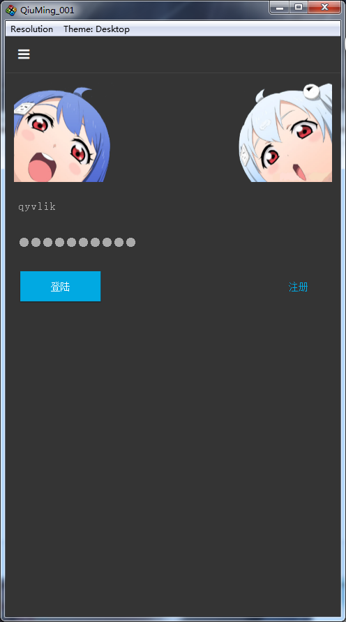

# 详细设计文档

## 导言

###  目的

本文档的目的是描述综合信息管理平台项目的详细设计，其主要内容包括：

* 系统功能简介
* 系统详细设计简述
* 各个模块的三层划分
* 最小模块组件的伪代码

本文档的预期读者是：

* 设计人员
* 开发人员
* 项目管理人员
* 测试人员

###  范围

该文档定义了系统的各个模块和模块接口，但未确定的具体实现，这部分内容将在实现中确定。

## 系统设计概述


## 详细设计概述

由于本系统采用了基于C/S体系结构的设计，并使用分层架构，采用面向对象的 Java 和 C++ 语言，所以基本采用，面向对象的设计方法。在整个开发过程中，尽可能采用复用的原则，例如采用标签库，复用 UI 控件，统一数据库的基本操作，统一显示结果，统一数据交互格式。

本文档的详细设计主要是按照Struts的MVC三层次分别描述视图层、控制层和模型层模块的伪代码、为下一步的编码提供基础。

## 系统架构设计

现取用户管理模块进行简单讲解

用户管理模块负责用户的登录，关注等操作。

系统框架可分成三层结构，即数据访问层、业务层，控制层，`socket` 层，用户模块具体如下表所示：

| 数据访问层 | 业务层 | 模块层 | 控制层 | socket 层 |
|:-----:|:---:|:---:|:---:|------------|
| UserDao | UserService | UserAction | ActionFilter | WebSocketServer |
| PostDao | PostService |  |  |  |
| PraiseDao |  |  |  |  |
| FavoriteDao |  |  |  |  |
| ComplainDao |  |  |  |  |

一个登陆流程为：

1. 客户端先通过 `WebSocket` 链接上服务器

2. 由客户端发起登陆请求

3. 服务器通过 `WebSocketServer` 接受到来自客户端的信息（带有格式的信息）

4. 通过 `ActionFilter` 控制层进行过滤，跳转到指定的模块层，这里跳转到 `UserAction` 登陆功能

5. 在 `UserAction` 登陆功能中进行数据持久化操作，然后直接在 `UserAction` 将执行结果以 `WebSocket` 方式发回给客户端，而不是一层层返回。

### C/S 沟通的信息结构

取登录为例，客户端发送 JSON 格式的信息到服务：

```
{ "action":"login", "username":"qyvlik", "password":"123456" }
```

在控制层进行解析，解析出 `action` 对饮的模块功能，然后跳转：

```
public void filter(WebSocketServer server, String message,
                   WebSocketClient client) {

    JSONObject action = JSON.parseObject(message);
    String actionString = (String) action.get("action");
    if (actionString == null) {
        System.out.println("action is null");
        ActionTools.sendError(action, client);
    } else if (actionString.equals("login")) {
        userAction.login(action, client);
    }
}
```

## 用户模块

| 数据访问层 | 业务层 | 模块层 | 控制层 | socket 层 |
|:-----:|:---:|:---:|:---:|------------|
| UserDao | UserService | UserAction | ActionFilter | WebSocketServer |
| PostDao | PostService |  |  |  |
| PraiseDao |  |  |  |  |
| FavoriteDao |  |  |  |  |
| ComplainDao |  |  |  |  |

用户模块在 **系统架构设计** 有提及，就不在此赘述。

## 帖子模块

| 数据访问层 | 业务层 | 模块层 | 控制层 | socket 层 |
|:-----:|:---:|:---:|:---:|:--------:|
| PostDao | PostService | PostAction | ActionFilter | WebSocketServer |
| PraiseDao |  |  |  |  |
| FavoriteDao |  |  |  |  |
| ComplainDao |  |  |  |  |

1. socket 层 主要负责解释来自客户端的信息（有格式的信息）然后传递到控制层。

2. 在控制层将信息解析后，在转发到对应的模块功能。

3. 在 `PostAction` 中调用业务层进行业务操作后，直接在 `PostAction` 中以 `WebSocket` 的方法将结果发回到客户端。

## 审核&管理模块

| 数据访问层 | 业务层 | 模块层 | 控制层 | socket 层 |
|:-----:|:---:|:---:|:---:|:--------:|
| UserDao | AdminService | AdminAction | ActionFilter | WebSocketServer |
| PostDao |  |  |  |  |

1. socket 层 主要负责解释来自客户端的信息（有格式的信息）然后传递到控制层。

2. 在控制层将信息解析后，在转发到对应的模块功能。

3. 在 `AdminAction` 中调用业务层进行业务操作后，直接在 `AdminAction` 中以 `WebSocket` 的方法将结果发回到客户端。

## 评论模块

| 数据访问层 | 业务层 | 模块层 | 控制层 | socket 层 |
|:-----:|:---:|:---:|:---:|:--------:|
| CommentDao | CommentService | CommentAction | ActionFilter | WebSocketServer |

## 社交模块

| 数据访问层 | 业务层 | 模块层 | 控制层 | socket 层 |
|:-----:|:---:|:---:|:---:|:--------:|
| FriendDao | FriendService | FriendAction | ActionFilter | WebSocketServer |
| UserDao |  |  |  |  |

1. socket 层 主要负责解释来自客户端的信息（有格式的信息）然后传递到控制层。

2. 在控制层将信息解析后，在转发到对应的模块功能。

3. 在 `FriendAction` 中调用业务层进行业务操作后，直接在 `FriendAction` 中以 `WebSocket` 的方法将结果发回到客户端。

## 发车模块

> 发车为高级发帖

| 数据访问层 | 业务层 | 模块层 | 控制层 | socket 层 |
|:-----:|:---:|:---:|:---:|:--------:|
| CarDepartDao | CarDepartService | CarAction | ActionFilter | WebSocketServer |
| CarAboardDao |  |  |  |  |
| PostDao | PostService | PostAction | ActionFilter | WebSocketServer |
| PraiseDao |  |  |  |  |
| FavoriteDao |  |  |  |  |
| ComplainDao |  |  |  |  |

1. socket 层 主要负责解释来自客户端的信息（有格式的信息）然后传递到控制层。

2. 在控制层将信息解析后，在转发到对应的模块功能。

3. 在 `CarAction` 中调用业务层进行业务操作后，直接在 `CarAction` 中以 `WebSocket` 的方法将结果发回到客户端。

## 客户端设计

客户端负责为用户提供一个良好的用户交互界面，以更加友好的方式体验服务。

### 原型

#### 登陆&注册页



#### 主页


#### 帖子


#### 客户端主页导航


### 使用框架

这里使用的是 Qt + v-play 作为开发框架。

由于客户端不实际保存用户数据，故不再客户端中设计持久化操作。

### 富文本展示

由于我们系统的帖子格式不采取富文本的方式保存而是使用 `markdown` 的格式保存，所以在客户端上进行 `markdown` 格式到 `html` 格式的转换和渲染。

这里使用 `hoedown` 作为本项目的 `markdown` 格式转换器。

> `hoedown` 项目主页为 https://github.com/hoedown/hoedown

通过注册函数，将包装过的转换器注册到软件的运行环境。

### 客户端页面设计

#### 初始化

在 `c++` 中设定入口的 `QML` 文件——`Main.qml`。

在 `Main.qml` 实例化 `WebSocket`，以便于服务器建立连接。

#### 启动使用流程

应用启动后，在用户未登录的情况下，就会跳转到登陆页面，进行登录操作，登陆成功后，就跳转到主页面。主页面展示最新的十条帖子，并且可以在主页进行瀑布流式浏览。

应用的抽屉菜单有**用户中心**，**我的收藏**，**关注的人**，**关于**，**设置**。

如下图：


#### 发帖流程

在用户发帖后，就可以回到首页进行浏览，修改帖子时，客户端进行检查用户合法性，然后将修改后的帖子提交到后台。后台再将结果发回到客户端。

### 组件

#### Socket 组件

```
import QtQuick 2.0
import Qt.WebSockets 1.0
import "./uuid.js" as UUID
import "./Component"

Item {
    id: socket

    WebSocket {
        id: webSocket
        url: "ws://localhost:8080/QiuMing002/websocket"
    }

    // action -> { "action":"login", "username":"qyvlik", "password":"123456" }
    // callable(messageObj)
    // err(messageObj)
    function send(action, callable, err) {

    }

    function login(username, password, callable, err) {

    }

    // 用户登出
    function logout(username, callable, err) {

    }

    // 由于用户登录了，是在服务端记录登陆状态的，所以在客户端只管发送请求
    function getUserPostList(userId, index, size, callable, err) {

    }

    function getPostList(index, size, callable, err) {

    }

    // 由于用户登录了，是在服务端记录登陆状态的，所以在客户端只管发送请求
    // 点赞
    function parisePost(postId, callable, err) {

    }

    // 由于用户登录了，是在服务端记录登陆状态的，所以在客户端只管发送请求
    // 取消赞
    function unparisePost(postId, callable, err) {

    }

    // 由于用户登录了，是在服务端记录登陆状态的，所以在客户端只管发送请求
    // 创建帖子
    function createPost(title, content, callable, err) {

    }

    // 由于用户登录了，是在服务端记录登陆状态的，所以在客户端只管发送请求
    // 修改帖子，还要传入 userId
    function modifyPost(userId, postId , title, content, callable, err) {

    }

    // 由于用户登录了，是在服务端记录登陆状态的，所以在客户端只管发送请求
    // 检查用户是否点赞了某篇帖子
    function checkUserParisePost(userId, postId, callable, err) {

    }
    // 由于用户登录了，是在服务端记录登陆状态的，所以在客户端只管发送请求
    // 用户 userId 收藏 帖子 postId 到 收藏夹 favoriteName
    function favoritePost(userId, postId, favoriteName, callable, err) {

    }

    // 由于用户登录了，是在服务端记录登陆状态的，所以在客户端只管发送请求
    // 用户 userId 取消收藏 帖子 postId 到 收藏夹 favoriteName
    function unfavoritePost(userId, postId, favoriteName, callable, err) {

    }

    // 由于用户登录了，是在服务端记录登陆状态的，所以在客户端只管发送请求
    // 检查用户 userId 是否收藏 帖子 postId 到 收藏夹 favoriteName
    function checkUserFavoritePost(userId, postId, favoriteName, callable, err) {

    }

    // 由于用户登录了，是在服务端记录登陆状态的，所以在客户端只管发送请求
    // 获取用户 favoriteName 收藏夹下所有的帖子
    function getUserFavoriteList(userId, favoriteName, callable, err) {

    }

    // 由于用户登录了，是在服务端记录登陆状态的，所以在客户端只管发送请求
    // 一次性获取用户所有关注用户
    function getFriendList(userId, callable, err) {

    }
}
```

#### 用户界面主题设置代码

```
        // 设置主字体颜色
        Theme.colors.textColor = "#ababab";
        // 设置应用背景颜色
        Theme.colors.backgroundColor = "#343434";
        // 设置导航条背景色
        Theme.navigationBar.backgroundColor = "#343434";
        // 设置导航条底部线条颜色
        Theme.navigationBar.dividerColor = "#434343";

        Theme.navigationAppDrawer.backgroundColor = "#343434";
        Theme.navigationAppDrawer.itemBackgroundColor = "#343434";
        Theme.navigationAppDrawer.itemSelectedBackgroundColor = "#5c5c5c";
        Theme.navigationAppDrawer.textColor = "#ababab";
        Theme.navigationAppDrawer.activeTextColor = "#b06176"
        Theme.listItem.activeTextColor = "#b06176";
        // Theme.listItem.backgroundColor = "transparent";
        Theme.listItem.backgroundColor = "#343434";
        // activeTextColor

        // 输入框
        Theme.colors.inputCursorColor = "#b06176";

        // 选项栏
        Theme.tabBar.titleColor = "#b06176"; //"#ababab";
        Theme.tabBar.backgroundColor = "#343434";
        Theme.tabBar.dividerColor = "#434343";
```
