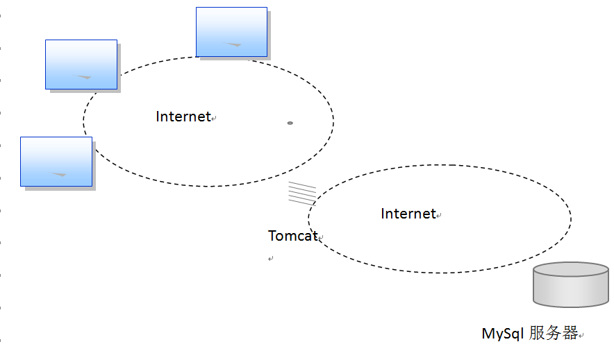
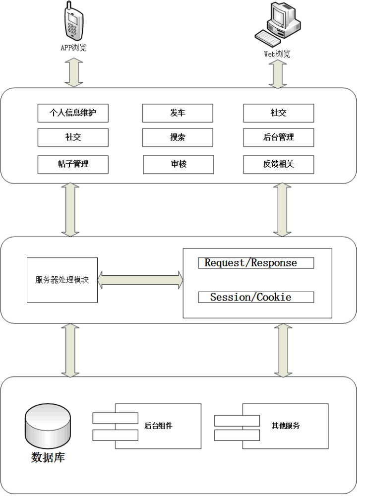
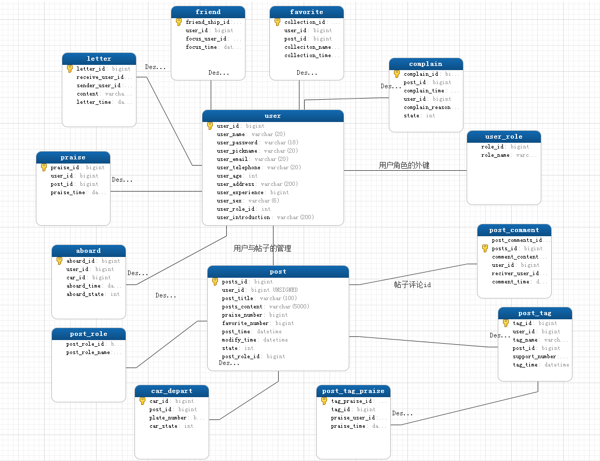

# 软件概要设计说明书

## 引言

### 编写目的

本说明是秋明飙车系统项目软件产品的总体设计和实现说明，记录了系统整体实现上技术层面的考虑，并且以需求说明作为依据，同时该文档将作为产品实现、特性要求和控制的依据。

软件开发小组的每一位参与开发成员应该阅读本说明，以清楚产品在技术方面的要求和实现策略，本手册将进行技术评审和技术的可行性检查，同时为下一步的详细设计说明提供框架。

## 背景

说明：

A. 软件系统的名称： 秋明飙车系统

B. 任务提出者：[提出者]
       开发者：XX软件开发小组

C. 本系统将是一个独立的系统，目前所产生的输出都是独立的

本系统将使用MySql作为数据库的存储系统  

### 定义

### 参考资料

参考资料：

A.  《秋明飙车系统软件需求规格说明》

B.  《软件工程 概要设计说明书》

C.  《Thinking in UML》谭云杰中国水利水电出版社

## 总体设计

### 需求规定

需求规定的详细内容，请参考独立的文档《秋明飙车系统软件需求规格说明书》。

### 运行环境

客户程序硬件要求：
　　具有Intel（R） Core T1110处理器且满足以下要求的计算机：
　　最低64 MB 内存
　　最小10 GB 硬盘
　　鼠标
　　键盘
　　服务器硬件需求：
　　具有 Pentium III 处理器且满足以下要求的计算机：
　　最低512MB 内存
　　最小1 TB 硬盘
　　鼠标
　　键盘

### 基本设计概念和处理流程

系统物理结构：

本系统的实现采用典型的三层模式、C/S结构来实现，不同的客户端程序共同访问

中心数据库，系统结构如图1：

设计说明：

A. 每一个计算机需要安装客户端；

B. 每个客户程序通过中间件访问中央的数据库服务器。

C. 数据库服务器使用MySql来实现；

D. 多用户并发访问和处理、数据加锁、事务协调，由MySql数据库和数据库服务器来完成；

系统结构图：
 

系统用例图：

根据系统结构和用例图我们可以把系统划分为七大模块，分别为用户模块、帖子模块、审核模块、发车模块、评论模块、社交模块和管理模块，以及相应的功能列表。

功能列表：

| 编号 | 名称 | 类别 | 子类别 | 子角色 | 角色 | 描述 |
|:--:|:--:|:--:|:---:|:---:|:--:|:--:|
| 1 | 注册 | 用户 | 用户相关 | 用户 | 用户 | 用户注册 |
| 2 | 修改用户资料 | 用户 | 用户相关 | 用户 | 用户 | 修改用户资料 |
| 3 | 修改密码 | 用户 | 用户相关 | 用户 | 用户 | 修改密码 |
| 4 | 登陆 | 用户 | 用户相关 | 用户 | 用户 | 用户登录 |
| 5 | 创建帖子 | 帖子 | 帖子相关 | 用户 | 用户 | 发帖 |
| 6 | 查看帖子 | 帖子 | 帖子相关 | 用户 | 用户 | 查看帖子 |
| 7 | 修改帖子 | 帖子 | 帖子相关 | 用户 | 用户 | 修改帖子 |
| 8 | 收藏帖子 | 帖子 | 帖子相关 | 用户 | 用户 | 收藏帖子 |
| 9 | 评论帖子 | 帖子 | 帖子相关 | 用户 | 用户 | 收藏帖子 |
| 10 | 帖子贴标签 | 帖子 | 帖子相关 | 用户 | 用户 | 帖子贴标签 |
| 11 | 赞同帖子的标签 | 帖子 | 帖子相关 | 用户 | 用户 | 赞同帖子的标签 |
| 12 | 查看帖子评论 | 帖子 | 帖子相关 | 用户 | 用户 | 查看帖子评论 |
| 13 | 点赞帖子 | 帖子 | 帖子相关 | 用户 | 用户 | 点赞帖子 |
| 14 | 删除帖子 | 帖子 | 帖子相关 | 用户/管理 | 用户 | 删除帖子 |
| 15 | 举报帖子 | 帖子 | 帖子相关 | 用户 | 用户 | 举报帖子 |
| 16 | 加关注 | 社交 | 社交相关 | 用户 | 用户 | 加关注 |
| 17 | 发送私信 | 社交 | 社交相关 | 用户 | 用户 | 发送私信 |
| 18 | 搜索私信 | 搜索 | 搜索相关 | 用户 | 用户 | 搜索私信 |
| 19 | 搜索用户 | 搜索 | 搜索相关 | 用户 | 用户 | 搜索用户 |
| 20 | 搜索车牌号 | 搜索 | 搜索相关 | 用户 | 用户 | 搜索车牌号 |
| 21 | 举报发车 | 发车 | 发车相关 | 用户 | 用户 | 举报发车 |
| 22 | 上车 | 发车 | 发车相关 | 用户 | 用户 | 上车 |
| 23 | 发车 | 发车 | 发车相关 | 用户 | 用户 | 发车 |
| 24 | 设置上车权限 | 发车 | 发车相关 | 管理/用户 | 用户 | 设置上车权限 |
| 25 | 审核发车 | 审核 | 管理相关 | 管理 | 用户 | 审核发车 |
| 26 | 审核帖子 | 审核 | 管理相关 | 管理 | 用户 | 审核帖子 |
| 27 | 审核评论 | 审核 | 管理相关 | 管理/用户 | 用户 | 审核评论 |

模块流程图：

### 功能器求与程序的关系

用一张如下的矩阵图说明各项功能需求的实现同各块程序的分配关系：

|  | 用户模块 | 帖子模块 | 评论模块 | 发车模块 | 社交模块 | 管理模块/审核模块 |
|:--:|:--:|:--:|:--:|:--:|:--:|:--:|
| 用户注册 | √ |  |  |  |  |  |
| 修改用户信息 | √ |  |  |  |  |  |
| 修改密码 | √ |  |  |  |  |  |
| 登陆 | √ |  |  |  |  |  |
| 创建帖子 |  | √ |  |  |  |  |
| 查看帖子 |  | √ |  |  |  |  |
| 修改帖子 |  | √ |  |  |  |  |
| 收藏帖子 |  | √ |  |  |  |  |
| 评论帖子 |  |  | √ |  |  |  |
| 帖子贴标签 |  | √ |  |  |  |  |
| 赞同帖子的标签 |  | √ |  |  |  |  |
| 查看帖子评论 |  |  | √ |  |  |  |
| 点赞帖子 |  | √ |  |  |  |  |
| 删除帖子 |  | √ |  |  |  |  |
| 举报帖子 |  | √ |  |  |  |  |
| 加关注 |  |  |  |  | √ |  |
| 发送私信 |  |  |  |  | √ |  |
| 搜索私信 |  |  |  |  | √ |  |
| 搜索用户 |  |  |  |  | √ |  |
| 搜索车牌号 |  |  |  |  | √ |  |
| 举报发车 |  |  |  | √ |  |  |
| 上车 |  |  |  | √ |  |  |
| 发车 |  |  |  | √ |  |  |
| 设置上车权限 |  |  |  | √ |  |  |
| 审核发车 |  |  |  |  |  | √ |
| 审核帖子 |  |  |  |  |  | √ |
| 审核评论 |  |  |  |  |  | √ |

### 人工处理过程

需要用户手动输入的数据，管理员审核的歩棸，及窗口或菜单栏选项进行信息确认或者选择。

### 尚未问决的问题

无。

## 接口设计

### 用户接口

TODO

### 外部接口

TODO

### 内部接口

TODO

## 运行设计

### 运行模块组合

本程序主要是以一个窗口为模块，一般一个窗口完成一个特定的功能，主窗口主要是通过打开另一个子窗口来实现模块之间不同功能的连接和组合。个模块之间相互独立，程序的可移植性好。个模块之间主要是通过传递数据项的引用来实现模块间的合作和数据共享。

### 运行控制

运行控制将严格按照各模块间的函数调用关系来实现。

在网络传输方面，客户机再发送数据后，将等待服务器的确认到信号，收到后，在此等待服务器发送数据，然后对数据进行确认服务器再接收到数据后发送确认信号，在对数据处理、访问数据库后，将饭返回信息送回客户机，并等待确认。

### 运行时间

各模块运行时间不定，这也跟用户的操作以及数据的大小有关。

## 系统数据结构设计

### 数据库原型

### 逻辑结构设计要点

1. 用户表（user）

     用户(用户编号, 用户名, 密码, 昵称, 邮箱, 电话, 年龄, 地址, 经验值, 性别, 角色编号, 简介)

2. 用户角色表（user_role）

    用户角色(用户角色编号, 用户角色名)

3. 帖子表（post）

    帖子(帖子编号, 用户编号, 帖子标题, 帖子内容, 赞同数, 收藏数, 发帖时间, 修改时间, 状态, 帖子分类编号)

4. 评论表（post_comment）

    评论(评论编号, 帖子编号, 评论内容, 用户编号, 被回复用户编号, 评论时间)

5. 帖子分类表（post_role）

    帖子分类( 帖子分类编号, 帖子分类名字)

6. 帖子标签表（post_tag）

    帖子标签(帖子标签编号, 用户编号, 标签名字, 帖子编号, 赞同此标签数, 帖子创建时间)

7. 帖子标签赞同表（post_tag_praise）

    帖子标签赞同(帖子标签赞同编号, 帖子标签编号, 用户编号, 赞同时间)

8. 私信表(letter)

    私信(私信编号, 接受私信用户编号, 发送私信用户编号, 私信内容, 私信时间)

9. 关注表（friend）

    朋友(关注编号, 用户编号, 被关注用户编号, 关注时间)

10. 点赞表（parsise）

    点赞(点赞编号, 用户编号, 帖子编号, 点赞时间)

11. 收藏表（favorite）

    收藏(收藏编号, 用户编号, 帖子编号, 收藏名字, 收藏时间)

12. 举报表（complain）

    举报(举报编号, 帖子编号, 举报时间, 举报用户, 举报理由, 举报状态)

13. 发车表（car_depart）

    发车(车牌编号, 帖子编号, 车牌号, 发车状态)

14. 上车表（car_aboard）

    上车(发车编号, 用户编号, 车牌编号, 发车时间, 发车状态)

ER图如下所示：

### 物理结构设计要点

TODO 从数据库原型图中物理结构设计要点

1、用户表
用户表(User)
描述	字段	数值类型	约束类型	备注
用户编号	id	long	PK	自增
用户名	username	Varchar(50)	UNIQUE	
密码	password	Varchar(32)		
邮箱	mail	Varchar(500)	UNIQUE	
性别	sex	int		
用户级别	level	int		

2、帖子表
帖子表(Post)
描述	字段	数值类型	约束类型	备注
帖子编号	id	long	PK	自增
用户编号	userid	long	FK	关联用户表
发帖时间	posttime	datetime		
审核状态	state	int		0:不通过 1:通过
帖子内容	content	text		
获赞数	praisenumber	int		
被收藏数	favoritenumber	int		

3、评论表
评论表(Comment)
描述	字段	数值类型	约束类型	备注
评论编号	id	long	PK	自增
用户编号	userid	long	FK	关联用户表
帖子编号	postid	long	FK	关联帖子表
审核状态	state	int		0:不通过 1:通过
评论内容	content	text		
评论时间	commenttime	datetime		
回复内容	replycomment	text		

4、私信表
私信表(Letter)
描述	字段	数值类型	约束类型	备注
私信编号	id	long	PK	自增
用户编号	userid	long	FK	关联用户表
被私信用户编号	touserid	long	FK	关联用户表
私信内容	comment	text		
私信时间	lettertime	datetime		
私信主题	topic	Varchar(500)		

5、关注表
关注表(Focus)
描述	字段	数值类型	约束类型	备注
关注编号	id	long	PK	自增
用户编号	userid	long	FK	关联用户表
被关注用户编号	touserid	long	FK	关联用户表
关注时间	focustime	datetime		

6、点赞表
点赞表(Praise)
描述	字段	数值类型	约束类型	备注
点赞编号	id	long	PK	自增
用户编号	userid	long	FK	关联用户表
帖子编号	postid	long	FK	关联帖子表
点赞时间	praisetime	datetime		

7、收藏表
收藏表(Favorite)
描述	字段	数值类型	约束类型	备注
收藏编号	id	long	PK	自增
用户编号	userid	long	FK	关联用户表
帖子编号	postid	long	FK	关联帖子表
收藏时间	favoritetime	datetime		
8、举报表
举报表(Complain)
描述	字段	数值类型	约束类型	备注
举报编号	id	long	PK	自增
用户编号	userid	long	FK	关联用户表
举报类型	type	int		0:帖子 1:发车
举报内容编号	typeid	long		帖子编号或发车编号
举报状态	state	int		0:成功 1:失败
举报时间	complaintime	datetime		

9、发车表
发车表(CarDepart)
描述	字段	数值类型	约束类型	备注
发车编号	id	long	PK	自增
用户编号	userid	long	FK	关联用户表
审核状态	state	int		0:不通过 1:通过
发车时间	departtime	datetime		
发车内容	comment	text		
车牌号	platenumber	Varchar(50)	UNIQUE	

10、上车表
上车表(Aboard)
描述	字段	数值类型	约束类型	备注
上车编号	id	long	PK	自增
用户编号	userid	long	FK	关联用户表
车牌号	platenumber	Varchar(50)		
上车时间	aboardtime	datetime		
上车描述	description	Varchar(500)		

11、帖子标签表
帖子标签表(PostTag)
描述	字段	数值类型	约束类型	备注
标签编号	id	long	PK	自增
用户编号	userid	long	FK	关联用户表
帖子编号	postid	long	FK	关联帖子表
标签内容	comment	Varchar(500)		
赞同数	supportnumber	int		
贴签时间	tagtime	datetime		

12、管理员表
管理员表(Administrator)
描述	字段	数值类型	约束类型	备注
管理员编号	id	long	PK	自增
登录名	loginname	Varchar(50)	UNIQUE	
登录密码	password	Varchar(32)		
邮箱	mail	Varchar(500)	UNIQUE	

### 数据结构与程序的关系

数据结构为关系型数据库，所以在程序中可以用标准的SQL语句与数据结构进行交互，交互过程中采用通用的数据反问接口。为了保持良好的程序架构，对数据库访问采用DAO设计模式实现，提高维护性和扩张性。

## 系统出错处理设计

### 出错信息

本程序多采用了异常处理机制，当遇到异常时不但能够及时处理，保证程序的安全性和稳定性，而且各种出错信息能够通过弹出对话框的形式，及时的告诉用户出错的原因和解决的方法，是用户以后能够减少错误的发生。程序的发部分还采取了出错保护，如输入内容的长度和类型减少了用户出错的可能。

### 补救措施

说明故障出现后可能采取的变通措施，包括：

A. 数据库连接错误：主要是数据库设置不正确或者SQL server异常引起的，只需要取消本次操作，检查数据库即可。

B. 输入错误：用户输入不规范造成的，应在尽量减少用户出错的条件的情况下，主要通过对话框，提醒用户，然后再次操作。

C. 其他操作错误：对于用户的不正当操作，有可能是程序发生错误。主要是中止操作，并提醒用户中止的原因和操作的规范。

D. 其他不可预知的错误：对于程序不可预知的错误，不可能作出完全的异常处理，这时主要保证数据的安全，所以要经常进行数据库备份，并及时联系维修人员，以逐步完善程序。

### 系统维护设计

由于系统较小没有外加维护模块，因为维护工作比较简单，仅靠数据库的一些基本维护措施即可。

